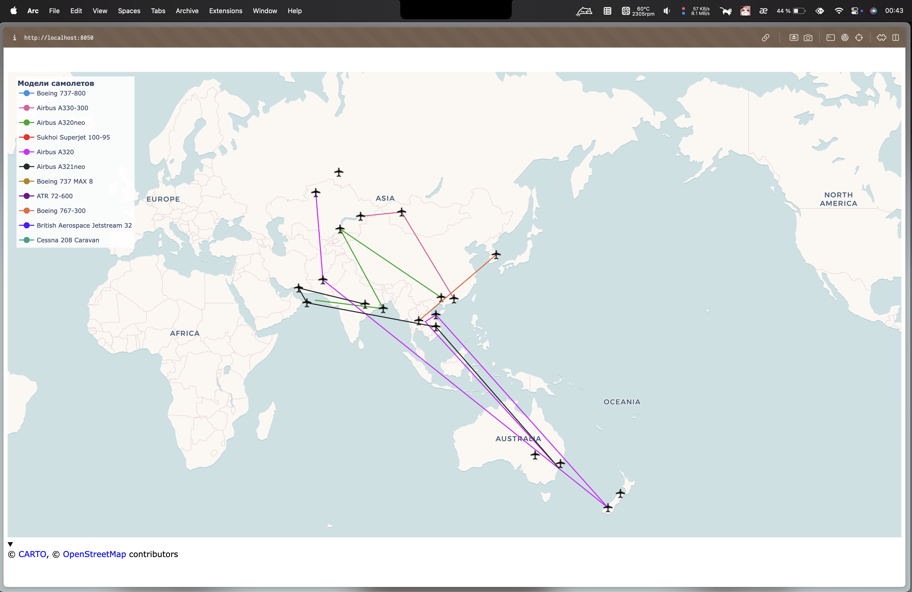
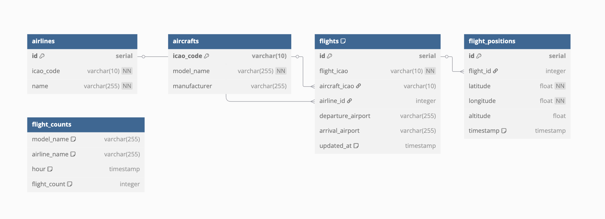

# aircraft_python

Система мониторинга авиарейсов в районе Черного моря с веб-интерфейсом

На момент теста не было полетов в районе черного моря, поэтому в config.py указаны координаты всей карты

Чтобы это изменить координаты нужно поменять цифры в BLACK_SEA_BBOX

```python
BLACK_SEA_BBOX = (41.0, 27.5, 44.5, 41.5) 
```



## Основные возможности
- 🛰 Реалтайм отслеживание активных рейсов
- 🌍 Фильтрация по зонам
- 🗄 Хранение данных в PostgreSQL
- 📊 Визуализация на интерактивной карте
- 🔄 Автоматическое обновление моделей самолетов

## Технологический стек
- **Python** (Scraper, Dashboard)
- **PostgreSQL** (Хранение данных)
- **Docker** (Оркестрация сервисов)
- **Dash/Plotly** (Веб-интерфейс)
- **AviationStack API** (Источник данных)

## Быстрый старт

### Предварительные требования
- Docker >= 20.10
- Docker Compose >= 1.29
- API ключ от [AviationStack](https://aviationstack.com/)

### Установка и использование
1. Клонируем репозиторий:
```bash
git clone https://github.com/INAUTUM/aircraft_python.git
cd aviation-monitoring
```
2. Добавляем свой API ключ в файл `.env`
3. Запускаем сервисы:
```bash
docker-compose up --build
```
4. Проверяем работоспособность:
```bash
docker compose ps
```
5. После успешного запуска сервисов можно посмотреть на веб-интерфейс по адресу `localhost:8050`
6. Можно обращаться к бд (данный запрос выведет icao и модель самолета):
```bash
docker exec -it aircraft_python-db-1 psql -U postgres -d aviation -c "SELECT icao_code, model_name FROM aircrafts;"
```

## Модель данных:



**Основные сущности:**
- `aircrafts` (самолеты)  
- `airlines` (авиакомпании)  
- `flights` (рейсы)  
- `flight_positions` (геопозиции)
- `flight_counts` (статисика рейсов)